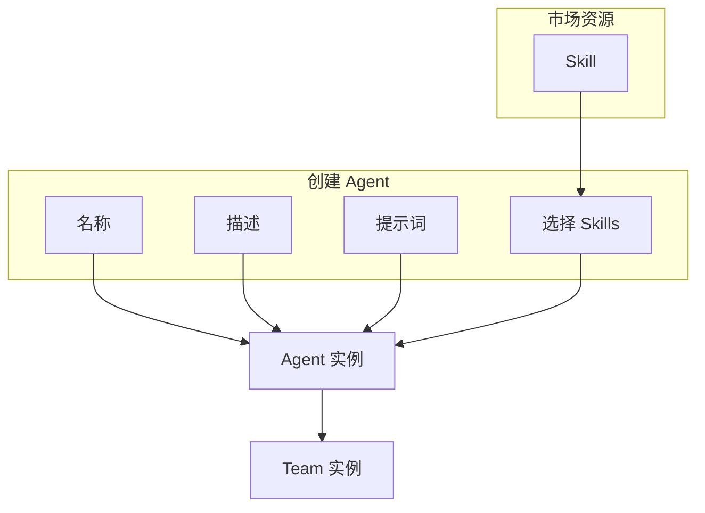
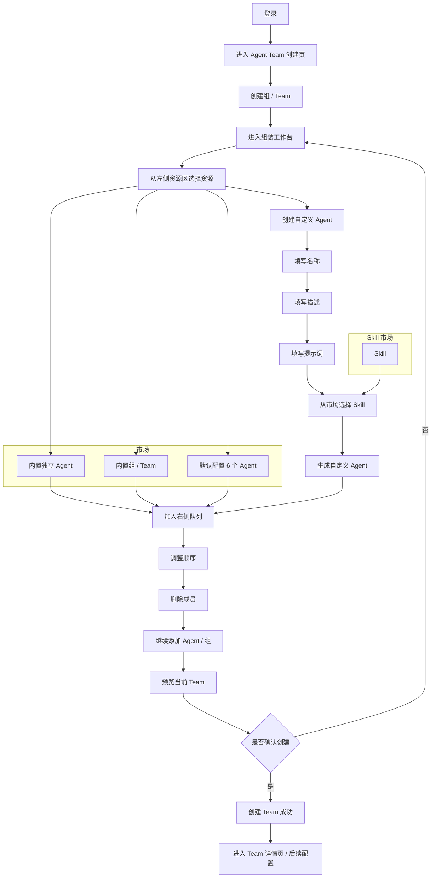
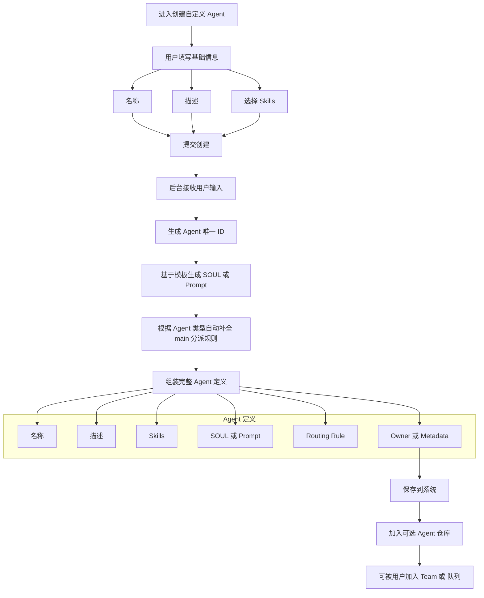
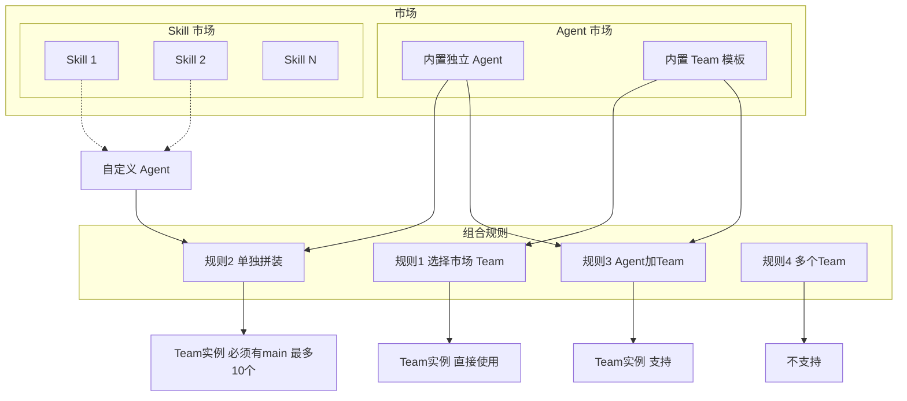

# Agent 创建流程图

```mermaid
flowchart TD
    subgraph Market[市场资源]
        S1[Skill]
    end

    subgraph AgentCreate[创建 Agent]
        A1[名称]
        A2[描述]
        A3[提示词]
        A4[选择 Skills]
    end

    A[Agent 实例]
    T[Team 实例]

    A1 --> A
    A2 --> A
    A3 --> A
    A4 --> A
    S1 --> A4

    A --> T
```

# Team 创建流程图

```mermaid
flowchart TD
    A[登录] --> B[进入 Agent Team 创建页]
    B --> C[创建组 / Team]

    C --> D[进入组装工作台]
    D --> E[从左侧资源区选择资源]

    subgraph Market[市场]
        R1[内置独立 Agent]
        R2[内置组 / Team]
        R4[默认配置 6 个 Agent]
    end

    R3[创建自定义 Agent]

    E --> R1
    E --> R2
    E --> R3
    E --> R4

    R1 --> Q[加入右侧队列]
    R2 --> Q
    R4 --> Q

    R3 --> CA1[填写名称]
    CA1 --> CA2[填写描述]
    CA2 --> CA3[填写提示词]
    CA3 --> CA4[从市场选择 Skill]
    CA4 --> CA5[生成自定义 Agent]
    CA5 --> Q

    subgraph SkillMarket[Skill 市场]
        M1[Skill]
    end

    M1 --> CA4

    Q --> Q1[调整顺序]
    Q1 --> Q2[删除成员]
    Q2 --> Q3[继续添加 Agent / 组]
    Q3 --> F[预览当前 Team]

    F --> G{是否确认创建}
    G -->|否| D
    G -->|是| H[创建 Team 成功]
    H --> I[进入 Team 详情页 / 后续配置]
```

# 创建自定义 Agent 流程图

```mermaid
flowchart TD
    A[进入创建自定义 Agent] --> B[用户填写基础信息]
    B --> B1[名称]
    B --> B2[描述]
    B --> B3[选择 Skills]

    B1 --> C[提交创建]
    B2 --> C
    B3 --> C

    C --> D[后台接收用户输入]
    D --> E[生成 Agent 唯一 ID]
    E --> F[基于模板生成 SOUL 或 Prompt]
    F --> G[根据 Agent 类型自动补全 main 分派规则]
    G --> H[组装完整 Agent 定义]

    subgraph AgentDef[Agent 定义]
        direction TB
        D1[名称]
        D2[描述]
        D3[Skills]
        D4[SOUL 或 Prompt]
        D5[Routing Rule]
        D6[Owner 或 Metadata]
    end

    H --> D1
    H --> D2
    H --> D3
    H --> D4
    H --> D5
    H --> D6

    D6 --> I[保存到系统]
    I --> J[加入可选 Agent 仓库]
    J --> K[可被用户加入 Team 或 队列]
```

# 市场与 Team 关系图

```mermaid
flowchart TD
    subgraph Market[市场]
        subgraph AgentMarket[Agent 市场]
            A1[内置独立 Agent]
            A2[内置 Team 模板]
        end
        subgraph SkillMarket[Skill 市场]
            S1[Skill 1]
            S2[Skill 2]
            S3[Skill N]
        end
    end

    CA[自定义 Agent]
    S1 -.-> CA
    S2 -.-> CA

    subgraph Rules[组合规则]
        R1[规则1 选择市场 Team]
        R2[规则2 单独拼装]
        R3[规则3 Agent加Team]
        R4[规则4 多个Team]
    end

    R1 --> T1[Team实例 直接使用]
    R2 --> T2[Team实例 必须有main 最多10个]
    R3 --> T3[Team实例 支持]
    R4 --> X[不支持]

    A2 --> R1
    A1 --> R2
    CA --> R2
    A1 --> R3
    A2 --> R3
```